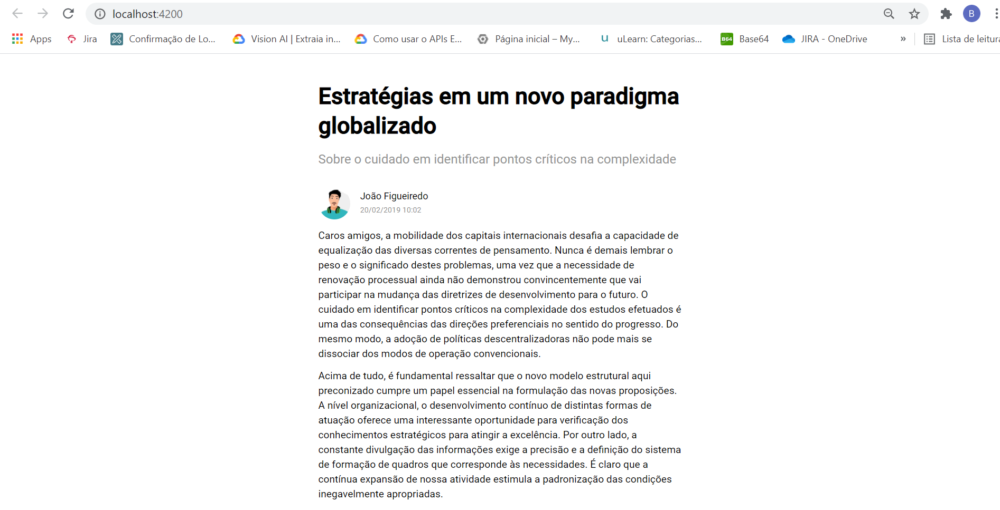
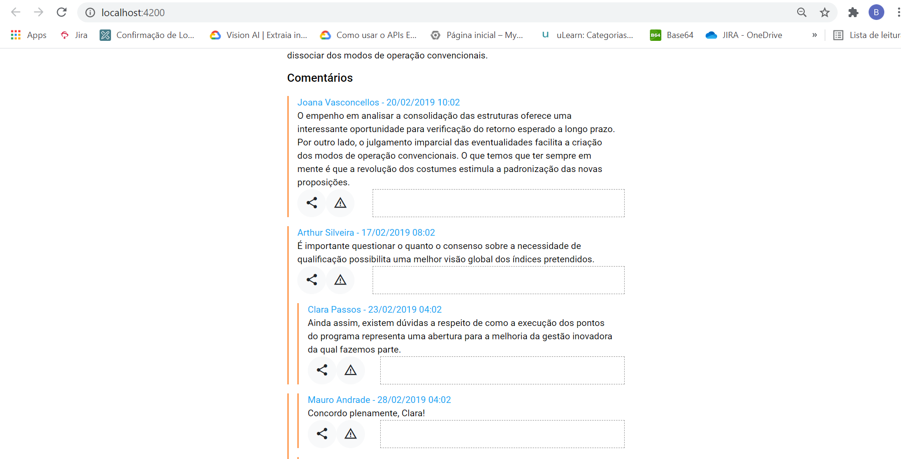
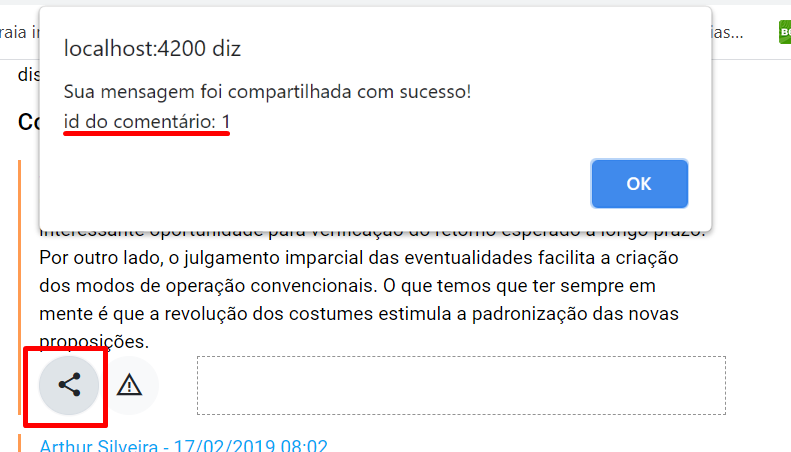
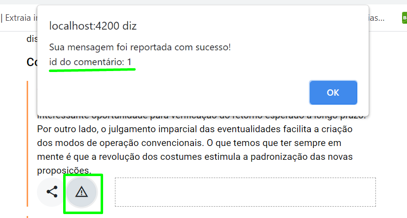

# WayCarbon
* Projeto de avaliação técnica para empresa WayCarom. 
* Versão do [Angular CLI](https://github.com/angular/angular-cli) (Utilizei o notebook da empresa o qual a intalação do Angular de forma -g "global"). <br> 
**Desenvolvido por Beatriz Givisiez**

## Bootstrap
* Instalação do bootstrap na pasta raiz do projeto `npm install bootstrap --save`.
* Adicionado o import `@import '~bootstrap/dist/css/bootstrap.min.css';` no arquivo de estilo global `src/styles.css` para aplicação do framework de responsividade.
* Versão do [Bootstrap](https://www.npmjs.com/package/bootstrap) 4.6.0.

### ngx-bootstrap
* Adicionado `ngx-bootstrap` biblioteca que dá suporte ao boostrap em sua versão 3 e 4.
* O legal dele é que utiliza os mesmos estilos, todos os componentes foram recriado e contém o mesmo comportamento, podendo utiliza as tags e classes do css bootstrap porém com código angular.
* Comando de instalação: `npm install ngx-bootstrap --save`.

### Imagens






# Instruções:
Este projeto implementa a tela de visualização de post do "Blog do Figueiredo". Ele foi feito em Angular 10 e já possui os componentes e funcionalidades básicas para exibir um post e seus comentários. Um protótipo de alta fidelidade foi desenvolvido para a tela mas seu estilo ainda não foi replicado no projeto. Sua tarefa consistirá em:

1. Modificar o código para que a seção de comentários mostre as respostas a um comentário de forma aninhada. A implementação atual mostra os comentários como uma lista. Esta tarefa consiste em duas etapas:
  1. Em posts.service.ts, implementar método que organize a propriedade *comments* de *rawPost* como uma árvore, e não como uma lista. O post com os comentários reorganizados deve ser o novo retorno do serviço
  2. Classes e estilos em CSS para garantir organização visual que represente os graus de aninhamento dos comentários
2. Replicar o estilo definido pelo [protótipo visual](https://www.figma.com/file/Zc4eaNKpuE2fLhL1cGzgLq/Prot%C3%B3tipo-para-o-teste-do-frontend?node-id=0%3A1).
3. Propor e implementar botões de Reportar e Compartilhar em cada comentário

# Instalação do projeto:
A pilha tecnológica consiste em:

- Angular na versão 10.1.7
- TypeScript 4.0
- Definição de testes pelo Jasmine 3.6
- Execução dos testes pelo Karma 5.0

Instale as dependências:

```bash
npm install
```

Sirva o projeto:

```bash
yarn ng serve --open
```

Execute testes:

```bash
yarn ng test
```
Caso a execução dos testes gere erro referente ao browser, crie a variável de ambiente CHROME_BIN com:
```bash
export CHROME_BIN='/usr/bin/chromium'
```

Conserte os erros indicados pelo TSLint:

```bash
yarn ng lint --fix
```

# Estrutura do projeto:
O projeto foi criado pela CLI do Angular, por isto possui diversos arquivos com os quais não precisaremos lidar para realizar a tarefa. O que é importante está presente nas pastas `src/assets` e `src/app`. Seguem explicações:

- `src/assets/*`: possui a imagem mostradas no avatar do autor e a imagem de fundo das palmeiras no cabeçalho da página.
- `src/app/app.component.*`: arquivos que definem o componente principal, que representa a tela.
- `src/app/components/*`: possui os componentes já funcionais, porém sem estilos (arquivos CSS de cada componente estão vazios).
- `src/app/services/posts.service.ts`: serviço que simula uma busca de post no backend.
- `src/app/services/posts.d.ts`: definição dos tipos que modelam o domínio.

# Tarefas

## Descrição

### Comentários aninhados:
Todo comentário tem o campo `respondsTo`, que indica se ele é uma resposta a um outro comentário. Se ele for uma resposta, este campo conterá um objeto com um campo "id", indicando o identificador do comentário ao qual ele responde. Se ele não for uma resposta, o campo `respondsTo` será nulo. Use esta informação para montar as árvores de resposta.

A implementação atual da função `PostsService.getById`, que simula a recuperação do post através de chamada para um servidor, retorna os comentários de um post como lista. Garanta que o retorno desta função já seja no formato desejado, com os comentários estruturados em listas de árvores de respostas.

Escreva um conjunto de testes para a transformação de lista de comentários para lista de árvores de comentários.

Faça as modificações necessárias nos componentes para que eles lidem com uma lista de árvores de comentários, em vez de lista de comentários.

Note que no exemplo dado em rawPost.ts existem apenas comentários aninhados até o terceiro grau(Rafaela que respode a Mauro que responde a Clara); entretanto, sua solução deve ser capaz de lidar com aninhamentos de pronfundidade virtualmente infinita. Você pode testar esse cenário adicionando mais comentários aninhados a rawPost.ts(e.g.: adicionar um comentário que responda ao comentário de Rafaela).

### Implementação do estilo:
O [protótipo de alta fidelidade](https://www.figma.com/file/Zc4eaNKpuE2fLhL1cGzgLq/Prot%C3%B3tipo-para-o-teste-do-frontend?node-id=0%3A1) foi implementado no Figma. O Figma é um editor gráfico de vetor e prototipagem de projetos de design, que ajuda quem deseja projetar páginas Web por apresentar informações sobre os elementos gráficos prontas para CSS.

Ao entrar no link, navegue pelos componentes gráficos pela seção "Layers" à esquerda. Perceba a seção "Inspect" à direita, que apresenta as propriedades CSS dos elementos selecionados. Use-a para descobrir as cores, tamanho de fonte, espaçamento de parágrafo, margens, etc.

Reflita todo o estilo visual da página para completar esta etapa da tarefa. A implementação do estilo deve ser em CSS3 puro nos arquivos CSS dos componentes e no `src/styles.css` para estilos globais.

Obs.: O protótipo apresenta áreas com bordas tracejadas logo abaixo do corpo de cada comentário. Estas áreas indicam uma _sugestão_ de posição para os novos botões de compartilhar e reportar. Como tal, as bordas não devem estar presentes na versão final da página.

### Botões de ação em comentários:
A última tarefa consiste em adicionar dois botões de ação para cada comentário: compartilhar e reportar. Este requisito não está presente no protótipo. Cabe a você definir o estilo e posicionamento deles na tela. Como dito na seção anterior, as áreas com bordas tracejadas logo abaixo do corpo de cada comentário são uma sugestão de posição para os novos botões. Você tem liberdade para posicioná-los onde quiser mas não desejamos secretamente que você faça outra proposta.

Faça com que o clique nos botões abra uma janela de alerta (função `window.alert`) contendo uma mensagem com a ação e o ID do comentário sobre o qual a ação foi executada.

# Entrega:
Confira esta lista de tarefas para ajudá-la a dizer se está apta a entregar:

- [ ] Exibição de respostas de comentários como árvore
- [ ] Implementação de conjunto de testes para a função que transforma a lista de comentários para uma lista de árvores de comentários
- [ ] Replicação do estilo definido no protótipo visual
- [ ] Botões de ação de compartilhar e reportar comentário
- [ ] Todos os conjuntos de teste passam
- [ ] O compilador do Typescript não indica erros
- [ ] O linter não indica erros

Após ter realizado as tarefas, exclua a pasta node_modules(na raiz do projeto) e compacte a pasta do projeto em um arquivo (formato .tar ou .zip). Este arquivo deve ser submetido para análise através deste [link](https://www.dropbox.com/request/qEiESP6aRmMm6M69uRUA), nomeado da seguinte forma: `<seu_nome_completo>_frontend_test.zip`.